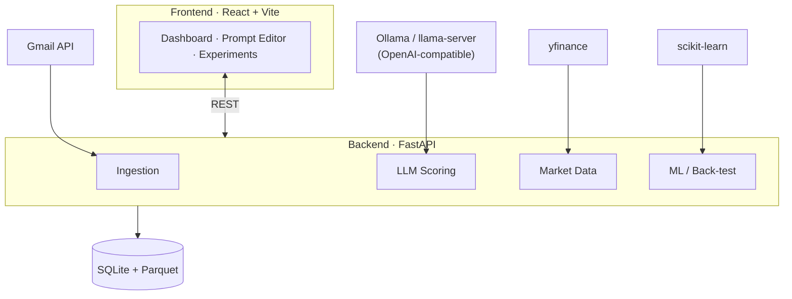

# LLM Market Scoring

> Turn financial newsletters into quantified, back-testable market signals — entirely on your own machine.


**LLM Market Scoring** ingests financial newsletters and articles, uses **local LLMs** to score assets
(stocks, index funds, and industries) on a continuous bullish/bearish scale, aligns those scores with
**future market returns** from [yfinance](https://github.com/ranaroussi/yfinance), and trains
**swappable scikit-learn models** on top to make market predictions — all surfaced in a **React dashboard**.

The long-term goal is a human-in-the-loop, self-correcting loop: the system proposes prompt edits based
on how well past scores predicted returns, and you approve them from the dashboard.

> [!NOTE]
> This is a local-first project. Your email content, OAuth tokens, models, and data never leave your machine.

## Features

- **Newsletter ingestion** — pull articles from Gmail (starting with Robinhood's "The Snack"), using the email timestamp as the signal time. Adding new sources is a pluggable parser.
- **Markdown-driven prompts** — each LLM scorer is defined by an editable Markdown file. Change the file, change the behavior. The same article runs through multiple prompts to score different assets.
- **Structured scoring** — every asset gets a JSON score: outlook in `[-1.0, +1.0]`, a confidence in `[0, 1]`, and a short rationale.
- **Swappable local models** — talk to any model served by Ollama or `llama-server.exe` via the OpenAI-compatible API; switch models with a config change, no code edits.
- **Return alignment & back-testing** — compare scores at article time against forward returns over multiple windows (1d / 1w / 1m / 3m).
- **Pluggable ML layer** — test different scikit-learn models on top of LLM scores + market features with walk-forward, leakage-safe evaluation.
- **Dashboard** — monitor scores, model performance, and experiments; edit prompts and approve self-correction suggestions.

> [!IMPORTANT]
> The system **reuses local LLMs you already have** — it never downloads models. It connects to a running
> Ollama server (`http://localhost:11434/v1`) by default, or to `llama-server.exe` from a local llama.cpp build.

## Architecture



**Data flow:** ingest newsletters → score each article through N LLM scorers → pull market data and
compute forward returns → align scores at time `t` against returns at `t + window` → train sklearn
models → evaluate prompts/models → propose prompt edits (you approve) → visualize.

## Tech stack

| Layer | Technology |
| --- | --- |
| Backend API | FastAPI · Uvicorn · Pydantic |
| LLM serving | Ollama / llama.cpp via OpenAI-compatible client (abstracted `LLMEngine`) |
| Storage | SQLite (metadata) · Parquet (timeseries/features) · SQLAlchemy · Alembic |
| Market data | yfinance · pandas · numpy |
| Machine learning | scikit-learn |
| Ingestion | Gmail API · BeautifulSoup |
| Frontend | React · TypeScript · Vite |

## Prerequisites

- **Python** 3.11+
- **Node.js** 20+ (verified with 24)
- **Git**
- A running local LLM server — **[Ollama](https://ollama.com)** is the default. Confirm with `ollama list`.

> [!TIP]
> Recommended starter models for an 8 GB GPU: `qwen2.5:7b` or `llama3.1:8b` for scoring, and
> `nomic-embed-text` for embeddings.

## Getting started

Clone the repository, then start the backend and frontend in separate terminals.

### 1. Backend

```powershell
cd backend
python -m venv .venv
.\.venv\Scripts\python.exe -m pip install -r requirements.txt
# optional dev tooling (pytest, ruff, black, mypy)
.\.venv\Scripts\python.exe -m pip install -r requirements-dev.txt

# a backend/.env is already provided; edit it to change model or provider
.\.venv\Scripts\python.exe -m uvicorn app.main:app --reload --port 8000
```

Verify it is up:

| Endpoint | Purpose |
| --- | --- |
| <http://localhost:8000/health> | API liveness |
| <http://localhost:8000/health/llm> | LLM reachability + available models |
| <http://localhost:8000/docs> | Interactive OpenAPI docs |

### 2. Frontend

```powershell
cd frontend
npm install
npm run dev   # http://localhost:5173
```

The dashboard shows backend status and the live list of local LLM models.

## Configuration

Backend settings live in `backend/.env`. The root [.env.example](.env.example) documents every key.

| Key | Purpose |
| --- | --- |
| `LLM_PROVIDER` | `ollama` (default) or `llama_server` |
| `LLM_BASE_URL` | OpenAI-compatible base URL (e.g. `http://localhost:11434/v1`) |
| `LLM_MODEL` | Default chat model for scoring (must exist in `ollama list`) |
| `EMBED_MODEL` | Embedding model (`nomic-embed-text`) |
| `LLM_NUM_CTX` | Context window to request (default `4096`) |
| `DATABASE_URL` | SQLite database path |
| `RETURN_WINDOWS` | Forward-return windows in trading days (`1,5,21,63`) |
| `GMAIL_*` | Gmail API ingestion settings (sender, OAuth file paths) |

Swap to llama.cpp by pointing `LLM_BASE_URL` at a running `llama-server.exe` (e.g. `http://localhost:8080/v1`)
and setting `LLM_PROVIDER=llama_server`.

## Project structure

```
llm-market-scoring/
├── backend/                  # FastAPI application
│   ├── app/
│   │   ├── main.py           # API entrypoint + health endpoints
│   │   ├── config.py         # settings (pydantic-settings)
│   │   └── llm/              # LLMEngine abstraction + score schema
│   ├── requirements.txt
│   └── .env                  # local config (git-ignored)
├── frontend/                 # React + Vite + TypeScript dashboard
│   └── src/
│       ├── api/client.ts     # typed backend client
│       └── App.tsx           # status dashboard
├── .env.example              # documented configuration template
└── TODO.md                   # full phased build plan
```

## Roadmap

The project is built in phases — from newsletter ingestion and LLM scoring through market alignment,
the ML layer, and finally a human-in-the-loop self-correction loop. The complete, checkbox-tracked
plan lives in [TODO.md](TODO.md).
